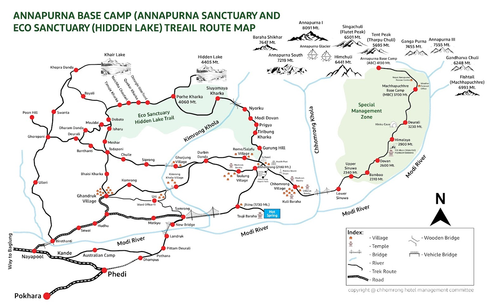

Eine selbstgeführte Wanderung mit Freunden in der Annapurna-Region ist mehr als eine Reise; es ist eine persönliche Odyssee voller gemeinsamer Momente und atemberaubender Landschaften. In diesem Blogbeitrag werde ich meine persönlichen Beweggründe für die Wahl dieses einzigartigen Abenteuers erläutern, dich durch praktische Aspekte wie die Organisation des Transports nach Pokhara und die Beschaffung von Genehmigungen auf eigene Faust führen, eine Kostenaufstellung liefern und ein sicheres und unvergessliches Trekkingerlebnis ermöglichen.

## Overview

- [Trekking in Nepal](#trekking-in-nepal)
- [Aktuelle Möglichkeiten](#aktuelle-möglichkeiten)
- [Den Transport planen](#den-trnasport-plannen)
- [Genehmigungen einholen](#genehmigungen-einholen)
- [Die Route organisieren und Unterkünfte sichern](#die-route-organisieren-und-unterkünfte-sichern)
- [Kostenaufstellung](#kostenaufstellung)
- [Empfehlung für Unternehmungen in Pokhara außer wandern](#empfehlung-für-eine-unternehmung-in-pokhara-außer-wandern)

### Trekking in Nepal

In der Geborgenheut des Himalaya liegt Nepal, ein Paradies fürs Trekking, in dem sich atemberaubende Landschaften nahtlos mit einem tiefen Eintauchen in die Kultur verbinden. Die Wege schlängeln sich durch eine lebendige Geschichte und führen die Wanderer durch alte Dörfer und vielfältige Gemeinschaften. Von den üppigen Terrassenfeldern bis hin zu den ruhigen Bergwiesen - Nepals Ausblicke hinterlassen einen unauslöschlichen Eindruck in der Seele. Trekking in Nepal ist eine spirituelle Reise, nicht nur körperliche Anstrengung, bei der wehende Gebetsfahnen und uralte Klöster eine himmlische Atmosphäre schaffen. Die Faszination des nepalesischen Trekkings erstreckt sich über alle Ebenen und bietet Herausforderungen wie das legendäre Everest Base Camp und kulturelle Odysseen durch Annapurna, die den unterschiedlichsten Ansprüchen gerecht werden.

Das ausgedehnte nepalesische Wanderwegenetz mit bekannten Routen wie dem Everest Base Camp und dem Annapurna Circuit sowie versteckten Juwelen wie dem Langtang-Tal oder Upper Mustang macht die Faszination noch größer. In der Annapurna-Region laden unzählige Wanderwege zur Erkundung ein, von denen jeder seinen ganz eigenen Charme hat, vom berühmten Annapurna Sanctuary bis hin zum faszinierenden Poon Hill Trek, der einen herrlichen Blick auf den Sonnenaufgang bietet. Gut ausgebaute Wege, Unterkünfte in Teehäusern und die herzliche Gastfreundschaft der örtlichen Gemeinden entlang des Weges sorgen dafür, dass die nepalesischen Wanderwege ein intensives Erlebnis der unvergleichlichen Schönheit des Himalayas bieten.

### Aktuelle Möglichkeiten

Als Liebhaber des unabhängigen Trekkings bietet sich denjenigen, die eine Reise ohne die Hilfe eines Reisebüros, Führers oder Trägers unternehmen möchten, eine einzigartige Gelegenheit, sich durch das Angebot an Trekkingmöglichkeiten zu bewegen. Während einige Wege einen Führer erfordern, passt eine Entdeckung in dieser Landschaft perfekt zu unserer Vorliebe für Autonomie und unseren begrenzten Zeitrahmen - der Annapurna Base Camp (ABC)-Trek.

Der Reiz dieser Reise von der lebhaften Stadt Pokhara bis zu den Höhen des Annapurna Base Camps liegt in der Freiheit, das Abenteuer selbst zu gestalten. Hier wird jeder Schritt zu einem Zeugnis der Großartigkeit des Himalaya - eine Erkundung, bei der sich die Landschaft ohne Zwänge entfaltet.

Inspiriert durch die unterstützende Gemeinschaft in einer Facebook-Gruppe namens [Backpackers and travelers in Nepal](https://www.facebook.com/groups/2282827915351254/?hoisted_section_header_type=recently_seen&multi_permalinks=3265005573800145), in der die Mitglieder wertvolle Erfahrungen austauschten, wurden wir ermutigt, uns für einen unabhängigen Annapurna Base Camp (ABC)-Trek zu entscheiden. Dieser Online-Bereich erwies sich als wahre Fundgrube für aktuelle Informationen und praktische Tipps, die unser Vertrauen in die Reise stärkten.

Darüber hinaus recherchierten wir gründlich auf der offiziellen [ABC-Trek-Website](https://annapurnatrekinfo.com/), die wichtige Details zu Genehmigungen, Wegbedingungen und Ausrüstung enthielt. Die kombinierten Erkenntnisse aus der Facebook-Gruppe und der offiziellen Website beeinflussten unsere Entscheidung und förderten das Gefühl einer gemeinschaftsorientierten Erkundung, die durch zuverlässige Ressourcen unterstützt wurde.

### Den Transport planen

Die Reise in die Annapurna-Region begann mit der Entscheidung, wie wir Pokhara, das Tor zu unserem Trekking-Abenteuer, erreichen sollten. Hier sind einige Optionen:

- Flug: Die Entscheidung für einen Inlandsflug von Kathmandu nach Pokhara erwies sich nicht nur als zeiteffizient, sondern beglückte uns auch mit Ehrfurcht einflößenden Luftbildern des Himalaya, ein guter Start in die Großartigkeit, die uns erwartete.
- Reisebus: eine beliebte Alternative ist der Reisebus nach Pokhara. Diese Überlandfahrt ist eine ebenso aussichtsreiche wie entspannte Reisemöglichkeit. Der Bus lässt dich die vielfältige Landschaft Nepals bewundern, indem er durch charmante Dörfer, üppige Täler und Terrassenfelder fährt. Die Fahrt dauert natürlich länger als ein Flug, aber dadurch hast du auch die Möglichkeit, schon an der Kultur dort teilzuhaben und die malerische Schönheit der Landschaften zu genießen. Zusätzlich kann die Busreise eine günstigere Option für Reisende sein, die aufs Budget achten und ein ausgewogenes Verhältnis zwischen Erschwinglichkeit und einem einzigartigen Reiseerlebnis bekommen.

Sobald wir dann in Pokhara waren, ging es als nächstes darum, wie wir zum Einstiegspunkt der Wanderung kommen würden. Wir entdeckten eine ganz bequeme Möglichkeit an der [Ghandruk Jeep Station](https://maps.app.goo.gl/pgvuqQdKZpz8znKj9, wo ein verlässlicher One Way-Service zur Jhinu-Brücke für NPR 7.500 angeboten wurde. Die Abholung direkt im Hotel in der Lakeside Area von Pokhara machte das Ganze noch effizienter und bequemer und hielt den finanziellen und logistischen Aufwand für unsere Dreiergruppe niedrig. Für Alleinreisende oder für die, die eine wirtschaftliche Option suchen, bietet die Jeepstation eine günstige Möglichkeit, sich mit anderen Wanderern eine Fahrt zu teilen, da die Summe gewöhnlich durch 6 oder 7 Mitfahrer geteilt werden kann. Die Wahl einer dieser Transportmöglichkeiten, um nahtlos von Pokhara zum Einstieg zu kommen, hängt von persönlichen Präferenzen ab, von der Größe der Gruppe und finanziellen Möglichkeiten.

### Genehmigungen einholen

Die Organisation für unsere Reise selbst zu übernehmen, bedeutete, dass wir die Genehmigungen eigenständig einholen mussten, was uns ein Gefühl der Verantwortung und Verbundenheit mit der Reise vermittelte.

- ACAP (Annapurna Conservation Area Permit): Die Genehmigung für die Annapurna Conservation Area einzuholen, erwies sich als unkomplizierter Prozess und die Verwaltung als einfach. Ein Besuch am ACAP-Schalter erforderte nichts weiter als Fotos in Ausweis-Größe, ein ausgefülltes Formular, unseren Pass und 3.000 NPR. Dieses greifbare Engagement für die Erhaltung der uns umgebenden Naturschönheiten war ein entscheidender Schritt auf unserer Reise. Die Genehmigung, die mit den Namen unserer Gruppenmitglieder versehen war, symbolisierte unseren Eintritt in eine Welt der Abenteuer und Verantwortung gleichermaßen.

Der Vorgang, der weniger als 30 Minuten dauerte, war stressfrei und effizient, auch weil wir selbst einen Stift zum Ausfüllen dabei hatten. Während unseres Besuchs im [ACAP-Büro](https://maps.app.goo.gl/rnVm7n1ozbeEjtJi7) fragten wir auch, ob wir weitere Genehmigungen brauchen würden. Die Beamten versicherten uns, dass wir für unsere selbstgeführte Wanderung nur die ACAP brauchen. Außerdem wurden wir informiert, dass, da wir ohne Guide laufen würden, wir einige Abschnitte der Genehmigung unausgefüllt lassen könnten, was den Prozess sogar noch einfacher machte. Diese Erfahrung war ein Beispiel dafür, wie einfach es ist, Genehmigungen für eine unabhängige Wanderung zu erhalten, so dass wir unsere Reise mit Zuversicht und einem großen Gefühl der Verbundenheit mit dieser wunderschönen Region antreten konnten.

### Die Route organisieren und Unterkünfte sichern

Wir haben unsere Reise strategisch geplant und dabei die Akklimatisierung und den begrenzten Zeitrahmen berücksichtigt, um eine umfassende Trekkingroute zu wählen. Da wir körperlich gut vorbereitet waren, konnten wir die Route so wählen, dass wir möglichst viel Zeit in den verschiedenen Landschaften verbrachten und so ein intensives Erlebnis hatten.

- Tag 1: Jhinu-Brücke nach Chomrong (Anstieg von 1730m auf 2140m): Unser Trek begann mit der Jeep-Fahrt von Pokhara zur Jhinu-Brücke. Da wir in Chomrong auf 1730 Metern starteten und später 2140 Meter erreichten, konnten wir uns an diesem ersten Tag schon nach und nach akklimatisieren. Wir sicherten uns eine Unterkunft in einer malerischen Pension in Chomrong.
- Tag 2: Chomrong nach Deurali (Anstieg von 2140m auf 3230m): Der Weg nach Deurali auf einer Höhe von 3230 Metern am zweiten Tag präsentierte uns beeindruckende Aussichten und eine abwechslungsreiche Kulisse. Die Übernachtung in Deurali bereitete uns auf die bevorstehenden Höhenmeter vor.
- Tag 3: Deurali zum Annapurna Base Camp (Anstieg von 3230m auf 4130m): Auf dem Weg zum Annapurna Base Camp auf 4.130 Metern Höhe erlebten wir die Großartigkeit des Himalaya. Die Nacht im ABC war ein denkwürdiger Abschluss des Tages.
- Tag 4: Annapurna Base Camp nach Bamboo (Abstieg von 4.130m auf 2.310m): Nachdem wir den atemberaubenden Sonnenaufgang im ABC erlebt hatten, stiegen wir nach Bamboo auf 2.310 m ab. Eine abwechslungsreiche Kulisse begleitete unsere Wanderung und bot eine einzigartige Perspektive auf die Landschaft.
- Tag 5: Bamboo zur Jhinu-Brücke, dann Fahrt nach Pokhara (Abstieg von 2.310m auf 1.730m): Die letzte Etappe führte uns von Bamboo zurück zur Jhinu-Brücke und beendete unseren Trek. Eine Jeepfahrt brachte uns dann zurück nach Pokhara und sorgte für ein stressfreies Ende unseres Abenteuers.

In Erwartung der großen Nachfrage in der Hochsaison, insbesondere von Reisebüros mit großen Gruppen, wurde die Sicherung von Unterkünften in Gästehäusern zu einer Priorität. Deshalb haben wir die in unserer Route aufgeführten Gästehäuser (wie auf den Bildern zu sehen) frühzeitig kontaktiert. Diese Vorsichtsmaßnahme sorgte dafür, dass wir an jedem Zielort eine bestätigte Unterkunft vorfanden, so dass wir uns nach jeder Tageswanderung beruhigt zurücklehnen und ausruhen konnten. Dieser proaktive Ansatz ermöglichte es uns, die Wanderung in vollen Zügen zu genießen, ohne uns Sorgen über die Verfügbarkeit während der Spitzenzeiten machen zu müssen, und trug so zu einem reibungslosen und angenehmen Erlebnis bei.

Darüber hinaus war es für unsere Trekkingvorbereitungen von entscheidender Bedeutung, einen angemessenen Versicherungsschutz zu gewährleisten. In Anbetracht der unvorhersehbaren Natur der Bergwelt schlossen wir eine umfassende Reiseversicherung ab, die medizinische Notfälle, Evakuierung und unvorhergesehene Umstände abdeckt. Diese Vorsichtsmaßnahme gab uns ein Gefühl der Sicherheit und ermöglichte es uns, uns auf das Abenteuer zu konzentrieren, da wir wussten, dass wir auf alle unerwarteten Herausforderungen vorbereitet waren, die während unserer Reise auftreten könnten.

### Kostenaufstellung

| ungefähre Kosten pro Person  | Betrag in NPR | Betrag in EUR |
| ---------------------------- | ------------- | ------------- |
| Genehmigung für ABC          | 3,000.00      | 19.35         |
| Bus nach Pokhara             | 1,700.00      | 11.00         |
| Transport zur Jhinu-Brücke   | 2,500.00      | 16.20         |
| Transport Jeep nach Pokhara  | 2,500.00      | 16.20         |
| Nacht 1 Ausgaben in Chomrong | 1,903.33      | 12.30         |
| Nacht 2 Ausgaben in Deurali  | 2,380.00      | 15.40         |
| Nacht 3 Ausgaben im ABC      | 3,833.33      | 24.75         |
| Nacht 4 Ausgaben in Bamboo   | 1,483.33      | 9.60          |
| Sonstige Ausgaben            | 1,190.00      | 7.70          |
| Rückflug nach Kathmandu      | 12,670.00     | 82.00         |
| Gesamt pro Person            | 33,160.00     | 214.50        |

Bei der Aufschlüsselung der ungefähren Kosten für eine Person, die sich auf den Annapurna Base Camp Treck begibt, wurden mehrere Faktoren berücksichtigt, um ein umfassendes Budget zu erstellen. Die Genehmigung für das Annapurna-Schutzgebiet (Annapurna Conservation Area Permit, ACAP), eine Grundvoraussetzung für die Reise, belief sich auf 3.000 NPR oder 19,35 EUR pro Person. Weitere größere Faktoren sind die Ausgaben für die Unterkunft im Base Camp sowie der Rückflug aus Kathmandu. Gering sind dagegen die Kosten für die Unterkunft in Bamboo oder die Busfahrt nach Pokhara.
Die Transportkosten, einschließlich der Busfahrt von Kathmandu nach Pokhara, des Transports zur Jhinu-Brücke (dem Ausgangspunkt des Treks) und der Jeepfahrt zurück nach Pokhara, wurden auf die drei teilnehmenden Personen aufgeteilt. Die sonstigen Ausgaben waren z.B. für Kaffee oder Tee während der Pausen. Die Gesamtkosten pro Person für dieses einzigartige Trekking-Abenteuer belaufen sich also auf ungefähr 215 Euro.

### Empfehlung für eine Unternehmung in Pokhara außer Wandern

Für diejenigen, die nur wenig Zeit haben oder andere Aktivitäten als wandern bevorzugen, bietet Pokhara eine Vielzahl unterschiedlicher Attraktionen, die die natürliche Schönheit und den kulturellen Reichtum der Region präsentieren. Die Stadt ist bekannt für ihre ruhigen Seen, wobei der Phewa-See ein zentraler Ort für Bootsfahrten und Entspannung ist. Darüber hinaus bietet das Internationale Bergmuseum einen Einblick in die reiche Geschichte des Bergsteigens in der Region. Für einen Hauch von Spiritualität bietet die Friedenspagode einen Panoramablick auf das Annapurna-Massiv und die Stadt darunter. Ein weiteres Highlight ist die faszinierende Gupteshwor-Höhle, die für ihre verschlungenen Felsformationen und einen versteckten Wasserfall bekannt ist.

Eine sehr empfehlenswerte Aktivität in Pokhara, insbesondere für diejenigen, die unter Zeitdruck stehen, ist der Sonnenaufgang am Sarangkot Viewpoint mit der Seilbahn. Dieses Erlebnis ist ein Muss, denn der Panoramablick auf die Annapurna- und Dhaulagiri-Bergketten bei Sonnenaufgang ist einfach atemberaubend. Die wechselnden Farbtöne des Himmels, gepaart mit der Silhouette der majestätischen Berge, schaffen ein surreales und ehrfurchtgebietendes Spektakel. Dieser Moment fängt das Wesen der Schönheit des Himalaya in seiner reinsten Form ein und ist für jeden Besucher eine unvergessliche Erinnerung.

Um mein Erlebnis am Sarangkot Viewpoint zu verbessern, habe ich [die Matador Pocket Blanket Mini](https://www.packingpanic.de/dp/34-79/matador-pocket-blanket-mini-black/#/3-farbe-schwarz) mitgebracht. Diese kompakte und tragbare Decke bietet nicht nur einen Platz zum Entspannen und Genießen der faszinierenden Aussicht, sondern lässt einen auch in das atemberaubende Bild der Annapurna-Kette eintauchen, während man es bequem hat. Sie ist das perfekte Accessoire, um sich zu entspannen und die Naturwunder zu genießen, die Pokhara zu bieten hat, und verleiht dem Besuch dieses bezaubernden Reiseziels eine zusätzliche Schicht an Komfort und Stil.

Der Aufbruch zu einem selbstgeführten Trek mit Freunden in der Annapurna-Region war nicht nur ein Abenteuer, sondern eine persönliche Odyssee, die von gemeinsamen Erfahrungen, atemberaubenden Landschaften und sorgfältiger Vorbereitung geprägt war. Wenn du dich auf dein eigenes Trekking-Abenteuer vorbereitest, möge es von demselben Gefühl der Erkundung, Kameradschaft und persönlichen Entdeckung erfüllt sein, das unsere unvergessliche Odyssee im Herzen des Himalaya geprägt hat.

### AWeitere Quellen

Lest auch meinen nächsten Beitrag mit einer [for a tailored packing list for the Annapurna trek](https://blog.packingpanic.de/posts/packing-for-annapurna-base-camp-trek/)

- Facebook-Gruppe: [Backpacker und Reisende in Nepal](https://www.facebook.com/groups/2282827915351254/?hoisted_section_header_type=recently_seen&multi_permalinks=3265005573800145)
- Transport von Pokhara zum Einstiegspunkt [Ghandruk Jeep Station](https://maps.app.goo.gl/pgvuqQdKZpz8znKj9) - Telefonnummer: +9779856010928
- Wandererlaubnis: [ACAP Entry Permit-Schalter in Pokhara](https://maps.app.goo.gl/rnVm7n1ozbeEjtJi7)
