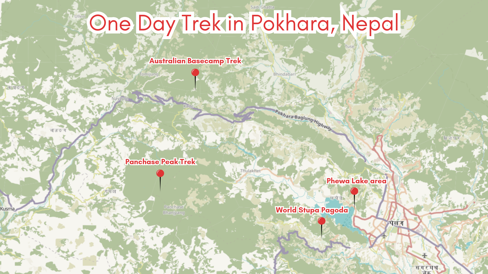

Pokhara, the tourism capital of Nepal, is a trekker's paradise. Nestled in a valley surrounded by the majestic Annapurna mountain range, this city offers easy access to some of the most breathtaking natural scenery in the world. If you're looking for a taste of adventure without the commitment of a multi-day trek, Pokhara has plenty of options for short, one-day treks that can be done independently.

## Overview

In this article, I like to recommend three great treks that can be done in a single day. The starting and ending points for these treks are relatively easy to reach from the tourist area of Pokhara. Some can be reached by a public bus. Have fun reading and hopefully see you at the treks soon!

- [Getting to Pokhara and Where to Stay](#getting-to-pokhara-and-where-to-stay)
- [World Pagoda and Shiva Temple Trek](#world-pagoda-and-shiva-temple-trek)
- [Australian Base Camp Trek](#australian-base-camp-trek)
- [Panchase Trek](#panchase-trek)
- [Tips for Trekkers](#tips-for-trekkers)

## Getting to Pokhara and Where to Stay

Pokhara is easily accessible from Kathmandu by air (a 25-minute flight) or by bus tourist coach (8-12 hours). Once in Pokhara, you can hire a taxi, order transport via a ride-sharing apps or take a local bus to reach the Lakeside area.

Pokhara offers a wide range of accommodation options, from budget guesthouses to luxury resorts. The Lakeside area is preferred for many travellers, as it's easier to get around and provides easy access to the trailheads, as well as stunning views of the lake and mountains. The following trek descriptions assume you will start your day trip at Lakeside.

## World Pagoda and Shiva Temple Trek

Explore Pokhara's spiritual and cultural heritage. The trek is packed with lots of highlights, like a boat ride and temple visit. Because of the steep ascends it is a bit challenging and not suitable for beginners.

- **Duration:** 3-4 hours (one way, when using the taxi to get back)
- **Difficulty:** Quite Challenging

### Highlights

- Scenic boat trip at Phewa Lake, Pokhara
- Visit the World Peace Pagoda, a massive Buddhist stupa offering panoramic views
- Walk to the Shiva Cave temple
- Head back the same way or catch a public bus/taxi to the your accomodation

### Significant trek way points

- [Boat station Phewa Lake - 28°12'52.5″N, 83°57'21.7″E](https://geohack.toolforge.org/geohack.php?params=28_12_52_N_83_57_21_E)
- [Dock for going to Stupa - 28°12'25.3″N, 83°56'52.1″E](https://geohack.toolforge.org/geohack.php?params=28_12_25_N_83_56_52_E)
- [World Stupa Pagoda, Pokhara - 28°12'03.8″N 83°56'41.2″E](https://geohack.toolforge.org/geohack.php?params=28_12_3_N_83_56_41_E)
- [Shiva Temple - 28°11'58.3″N 83°55'46.0″E](https://geohack.toolforge.org/geohack.php?params=28_11_58_N_83_55_45_E)

Starting with a boat ride on Phewa Lake, the trek sets a contemplative tone, a prelude to the cultural exploration. The gradual climb to the revered World Peace Pagoda offers both a physical challenge and a metaphorical ascent towards enlightenment, with panoramic vistas of the Annapurna range and Pokhara city.

The trek's allure lies in both traversing the trail and the metaphysical journey of self-discovery. When I was doing the trek, I felt touched by the wonder of ethereal landscapes and the harmony of nature and cultural heritage. In my opinion, this trek is a good blend of Pokhara's spiritual and cultural treasures.

You can head back the same way or catch a public bus/taxi to the your accomodation.

### Australian Base Camp Trek

Discover the charm of the Australian Base Camp trek, nestled in the Annapurna foothills. This journey is brimming with highlights, from scenic vistas to cultural encounters. With its steep ascents, it offers a moderate challenge, best suited for those with some trekking experience.

- **Duration: 4-6 hours**
- **Distance: 8 Km**
- **Difficulty: Challenging**

**Highlights:**

- Scenic trek to the Australian Camp
- Breathtaking views of the Annapurna and Machhapuchhre (Fishtail) peaks
- Opportunity to spot a variety of bird species and wildlife

**Transportation**

- Ride-sharing drive/taxi from Lakeside to Baglung Bus Park
- Take a local bus to Phedi to start the hike
- After the trek, take the same bus from Kande to Baglung Bus Park
- Ride-sharing drive/taxi to your accomodation

### Significant trek way points

- [Baglung Bus Park - 28°13'51.2″N 83°58'56.1″E](https://geohack.toolforge.org/geohack.php?params=28_13_51.2_N_83_51_39.6_E)
- [Phedi Bus Stop - 28°17'13.3″N 83°51'39.6″E](https://geohack.toolforge.org/geohack.php?params=28_17_13.3_N_83_51_39.6_E)
- [Australian Base Camp View Point - 28°18'11.1″N 83°49'47.8″E](https://geohack.toolforge.org/geohack.php?params=28_18_11.1_N_83_49_47.8_E)
- [Kandhe Bus Stop - 28°17'44.4″N 83°49'17.9″E](https://geohack.toolforge.org/geohack.php?params=28_17_44.4_N_83_49_17.9_E)

This trek offers a lovely day in the Annapurna foothills, with stunning views of the Annapurna mountain range along the way. You can start from Phedi and ending in the charming village of Kande or vice versa.

Start the morning journey from the Baglung Bus Park. It is not the tourist bus station you might have arrived at from Kathmandu. At Baglung Bus Park, hop on a bus to Australian Basecamp via Phedi. The busy bus park might seem chaotic, but locals are friendly and helpful in guiding you to the right bus. The fare is just a few hundred rupees.

In about 20 minutes on the bus, you'll see the stunning Annapurna range. After an hour, you'll reach Phedi, a small town with stairs marking the start of your trek.

The trek to Australian Basecamp involves some steep stairs initially, but don't worry if you need to catch your breath. The views make it worthwhile. As you climb, you'll pass farmhouses and get a glimpse into local life.

Carry on up the stairs and hills, and just before you reach Dhampus, you'll catch sight of your first mountain view. I paused for a break at a restaurant where I could see kids playing around in front of their school, Shree Prithvi Narayan Madhyemik School, and also take in the breathtaking view of the Annapurna mountain range.

From here, it's just about 3 km to the Australian Basecamp viewpoint, which offers even more amazing views. It's definitely worth the little walk to see the stunning scenery all around. After enjoying the view, you can keep going towards Kande to finish your trail. What's cool is that the whole trail is only about 8 km long, so it's not too tough, but you'll still have an incredible adventure surrounded by the beautiful Himalayas.

If you fancy trekking the other way round, starting from Kande and ending up at Phedi has its own special vibe. Setting off from Kande means you get to ease into it, walking through peaceful forests and beautiful scenery. And as you head down towards Phedi, you'll be treated to the breathtaking sight of the Annapurna range. Going this way might be perfect if you prefer a more relaxed downhill walk or if you want to finish your trek on a high note. Whichever way you choose to go, both paths guarantee amazing views and unforgettable moments in the stunning Himalayas.

### Panchase Trek

Experience the captivating Panchase Trek, boasting breathtaking views of the Annapurna range and rich biodiversity along forested trails. With its challenging route from Kande to Panchase Peak, this journey promises unforgettable adventures amidst nature's beauty. Recommended for seasoned adventurers seeking a rewarding challenge and stunning scenery.

- **Duration: 6-8 hours**
- **Distance: 23 km**
- **Difficulty: Very Challenging**

**Highlights:**

- Trek from Kande to Panchase Peak, with breathtaking views of the Annapurna range
- Rich biodiversity and forested trails along the way

**Transportation**

- Ride-sharing drive/taxi from Lakeside to Baglung Bus Park
- Take a local bus to Kande to start the hike
- After the trek, take a local bus from Ghatichina to Lakeside
- Last bus leaves at 5pm!

### Significant trek way points

- [Baglung Bus Park - 28°13'51.2″N 83°58'56.1″E](https://geohack.toolforge.org/geohack.php?params=28_13_51.2_N_83_51_39.6_E)
- [Kandhe to Panchase Stop - 28°17'29.5″N 83°49'31.6″E](https://geohack.toolforge.org/geohack.php?params=28_17_29.5_N_83_49_31.6_E)
- [Panchase Peak - 28°13'45.6″N 83°47'55.7″E](https://geohack.toolforge.org/geohack.php?params=28_13_45.6_N_83_47_55.7_E)
- [Ghatchhina Bus Park - 28°14'18.5″N 83°51'44.1″E](https://geohack.toolforge.org/geohack.php?params=28_14_18.5_N_83_51_44.1_E)

Important: Start this trek early enough in the morning, because the last bus, which brings you back to Likeside, is at 5pm from Ghatchhina Bus Park.

The starting journey can be reached by a local bus with the same route for the previous trek. Embarking on the trek from Kande to Panchase Peak and then descending to Ghatichina presents a challenging yet rewarding escapade, providing an immersive connection with nature. The trail meanders through verdant, dense forests, creating a vibrant tapestry of flora and fauna.

Approaching Panchase Peak, the trail opens up to unveil breathtaking panoramic views of the majestic Annapurna range and the picturesque Pokhara valley. The sheer beauty of the landscape is bound to leave you awe-inspired, providing a perfect backdrop for capturing memorable moments and indulging in the tranquillity of the surroundings.

While the trek poses a challenge, the rewards are plentiful, not only in the form of scenic vistas but also in the sense of accomplishment that comes with conquering the trail. As you make your way down to Ghatichina, the landscape changes, offering new perspectives and perhaps revealing more surprises along the way.

This route is also perfect for trail running enthusiasts. With diverse terrain and challenging inclines and declines, runners can test their endurance while enjoying the stunning natural scenery. The Panchase Trek offers an exhilarating opportunity for runners to push their limits and appreciate the beauty of the Annapurna region from a unique perspective.

### Tips for Trekkers

**Best Time to Trek:**
The months of March-May and September-November offer the best weather conditions for trekking around Pokhara. The skies are clear, and the temperatures are mild, making it ideal for hiking.

**Packing Essentials:**
Ensure you have comfortable hiking shoes, lightweight and breathable clothing, a hat, sunglasses, sunscreen, a water bottle (with enough water), snacks, and a basic first-aid kit.

Additionally, pack your [lightweight charging cables](https://www.packingpanic.de/suche?controller=search&s=tech-savy) and power bank to keep your devices powered during extended hikes. It's important especially if you use your smartphone for navigation, photography, or staying connected. For added convenience, consider bringing along [the Matador Pocket Blanket](https://www.packingpanic.com/dp/50-84/matador-pocket-blanket-size-160cm-x-110cm/#/3-colour-black), a dry, clean place to sit – anywhere, anytime, making it compact and stylish for carrying on your outdoor adventures.

**Local Guides:**

While you can do these treks on your own, having a local guide can make your experience even better. Guides don't just ensure your safety; they bring the whole experience to life. Imagine walking through stunning landscapes while your guide shares captivating stories about the area's history and traditions. They'll point out unique plants and animals, and lead you through hidden trails and secret spots you might otherwise miss. With their knowledge, your understanding and appreciation of the local culture deepen, making your journey truly unforgettable.

**Offline Maps:**

Staying on the right path during your hike is crucial, especially in remote areas with limited cellular coverage. That's why I recommend downloading offline maps to your smartphone before embarking on your adventure. Apps like Maps.me and Google Maps offer this feature, allowing you to access detailed maps of various regions even without an internet connection.

Both Maps.me and Google Maps provide offline map functionality, making them valuable tools for outdoor exploration. While Google Maps allows you to download offline maps as well, it's worth noting that Maps.me stands out for its utilization of OpenStreetMap (OSM) data. This means that Maps.me often offers more detailed information on hiking trails and lesser-known routes, making it a preferred choice for adventurers looking to explore off-the-beaten-path destinations.

Pokhara is a true trekker's paradise, offering a plethora of short, one-day treks that can be enjoyed independently. From the spiritual journey to the World Peace Pagoda to the awe-inspiring vistas of the Annapurna range at the Australian Camp and Panchase Danda, these treks cater to varying levels of difficulty and interests.

I hope this blog post has inspired you to explore the natural wonders around Pokhara and experience the joy of trekking in this beautiful region. For those looking to take on more challenging and longer treks, be sure to check out [another article on the Annapurna Base Camp trek and other multi-day hikes in the region](/posts/annapurna-base-camp-trek/). These articles provide detailed information, tips, and insights to help you prepare for and conquer these incredible trekking routes
