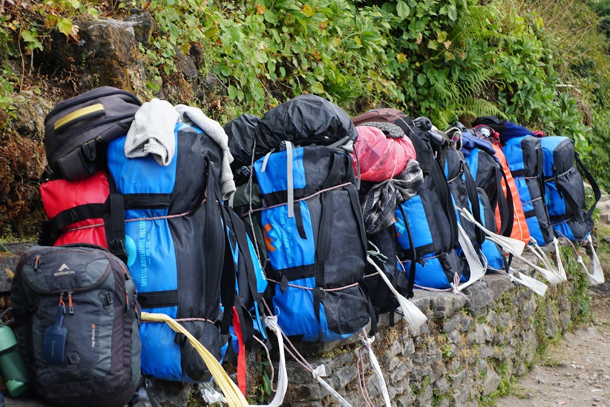
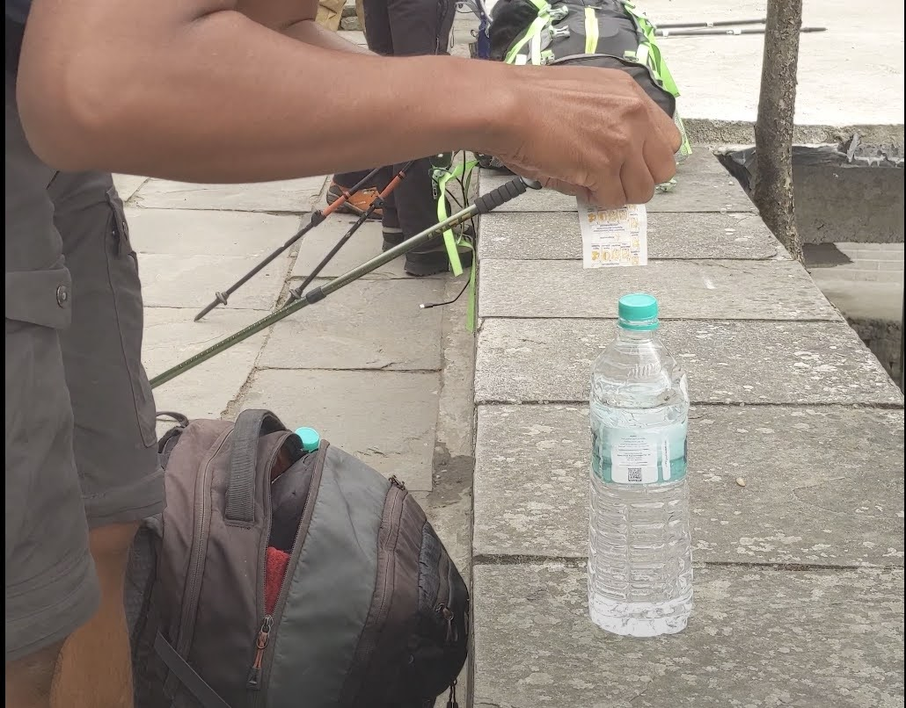

Embarking on an [independent trek to the Annapurna Base Camp](/posts/annapurna-base-camp-trek/) is a journey that promises not only breathtaking landscapes but also a profound sense of self-discovery. Unlike guided treks, shouldering the responsibility of your gear adds a unique layer to the adventure. In this comprehensive guide, we'll explore the essentials for a successful and enjoyable trek, based on our recent experience, with a keen focus on practicality and comfort.

## Overview

- Packing List
- The Lesson Learned from the Packing List
- Other important things to keep in mind

### [Packing List](#packing-list)

Previously, we published articles about [hiking in Rinjani](/posts/conquering-mount-rinjani/) and provided [a packing list for that trek](/posts/packing-for-rinjani/). However, trekking in Annapurna Base Camp offers a completely different experience. During this trek, we'll be spending most nights in guest houses that provide comfortable beds and blankets. One notable difference is that we won't need to carry food, as we can conveniently purchase meals at the restaurants owned by these guest houses along the way. It's worth noting that the prices at these higher-altitude restaurants may be on the steeper side. For a breakdown of spending, refer to our previous article: Annapurna Base Camp Trek.

Staying true to the mission of Packing Panic, which is to optimize luggage and enhance the overall travel experience, I strive to keep my backpack as light as possible. I also choose to leave some items at the hotel in Pokhara to streamline my trekking essentials.

Here is the list:

- T-Shirts:
  - 5 T-Shirts (including 1 Merino Wool)
- Outer Layers:
  - Down Jacket
  - Hat
  - Head Bunny
  - Gloves
  - Windcheater Jacket
  - 2 Hiking Pants (1 for Hiking, 1 for Resting)
  - Thermal Pants
- Accessories and Others:
  - Packing Sacks for Organization
  - Lightweight Towel
  - 3 pairs of socks
  - Underwear
  - Hiking Shoes
  - Sandals
  - Water Bottle
  - Jumper
  - Power Bank
  - Electronic Essentials (Chargers & cables)
- Backpack:
  - 28 L Backpack

### Lesson Learned From The Packing List

While I'm content with my packing list, the journey unfolded, offering valuable insights.

#### Merino Wool T-Shirts:

In hindsight, I wish I could have brought more Merino wool t-shirts for the trek, as I ended up having only one. Opting for 2-3 would have been a practical choice, considering their quick-drying feature and resistance to odors. With the Merino wool T-shirts, there is no need to bring so many shirts as I have done since you can reuse the Merino tees more often and also wash them and dry them easier then my cotton tees. I can recommend the T-shirts like the [Icebreaker Tech Lite II Merino T-Shirts for Men](https://www.packingpanic.de/dp/9-122/icebreaker-merino-tech-lite-ii-short-sleeve-t-shirt-herren/#/31-grosse-m/66-farbe-go_berry) or [Icebreaker Tech Lite II Merino T-Shirts for Women](https://www.packingpanic.de/dp/66-163/icebreaker-tech-lite-ii-t-shirt-frauen/#/33-grosse-xs/69-farbe-gritstone_heather).

#### Trekking Pole:

As the trail unfolded its uneven choreography, the trekking pole became a balletic partner. With each rhythmic step, it added grace to the ascent and cushioned the descent, transforming the trek into a dance with nature. Stability, once a challenge, became an elegant pas de deux with the trekking pole.

While I embarked on this journey with confidence in the strength of my feet, the trail's intricate dance left me contemplating the benefits of a trekking pole. The rhythmic partnership between a trekker and their pole became evident, offering not only stability but a nuanced connection with the terrain. In retrospect, I wished I had brought one along, and for fellow trekkers seeking this additional support, it's reassuring to know that trekking poles are available at affordable prices in Pokhara, typically around NPR 1500 for a pair. This local option provides an accessible solution for enhancing stability and adding a touch of grace to your trekking experience.

#### Poncho/Rain Jacket:

The Himalayan sky, an unpredictable conductor, played a symphony of weather whims. A lightweight poncho or rain jacket joined the ensemble, becoming a shield against unexpected snowfall. This addition added a rhythmic beat to the journey, echoing the harmony of preparation in the face of nature's caprices.

Reflecting on the journey, I realized the value of a lightweight poncho or rain jacket as an essential element in the trek's orchestration. The unpredictable mountain weather introduced me to unexpected snowfall, a challenge that a well-prepared rain jacket could have effortlessly met. However, in my eagerness, I overlooked this crucial piece of gear. In hindsight, I wish I had brought one along, as it would have added not only a protective layer against the elements but also a harmonious note to the symphony of my trekking experience. For future trekkers, this serves as a gentle reminder to include a reliable rain jacket in their packing checklist, ensuring a seamless dance with the unpredictable Himalayan weather.

#### Sleeping Bag:

Amidst the silent nights of the Himalayas, the warmth of guest house blankets became a lullaby. Yet, a lightweight sleeping bag emerged as the serenade of comfort, an extra layer of insulation ensuring that each night's rest was cocooned in warmth. The sleeping bag became not just an item but a melody in the trek's composition.

Reflecting on my personal choice, I opted not to bring a sleeping bag, relying on the comfort provided by guest house blankets. While many trekkers prefer to bring or rent a sleeping bag, I found that the warmth of the guest house accommodations was sufficient for my needs. However, this choice is subjective and depends on individual preferences and comfort levels. For those embarking on a similar trek, it's essential to assess personal requirements and the expected temperatures to make an informed decision on whether to include a sleeping bag in their gear.

#### Pack Sacks for Organization:

In the intricate dance of the trek, meticulous organisation took center stage, and the ensemble of pack sacks emerged as the graceful ballet dancers in the theater of cleanliness. Each pack sack played a unique role, transforming the mundane act of packing into a symphony of order and freshness.

- [Red/Orange Tatonka Packsack 1L](https://www.packingpanic.de/dp/11-4/packsack-1l/#/4-farbe-red_orange) carrying delicate electronic equipment.
- [Blue Tatonka Packsack 4L](https://www.packingpanic.de/dp/17-14/packsack-4l/#/15-farbe-blau) for clothing
- [Light Blue Tatonka Packsack 5L](https://www.packingpanic.de/dp/20-26/packsack-5l-sqzy-ultraleicht/#/14-farbe-hellgrau) for evening clothing
- [Matador Flatpak Zipper Toiletry Case](https://www.packingpanic.de/dp/35/matador-flatpak-zipper-toiletry-case/) to keep all my items for personal hygiene
- [Lime Tatonka Drybag 2L](https://www.packingpanic.de/dp/21-35/dry-bag-2l-tpu/#/6-farbe-limettenfarbe), to keep my dirty laundry. The waterproof bag ensures that nothing inside contaminates the rest of my belongings

Tip: For those in search of pitch-perfect packing organisers, explore [Packing Panic's Bags and Sacks](https://www.packingpanic.de/shop/25/bags-and-sacks/). Packing Panic is especially addressing light backpackers so you will find a plentitude of bags and sacks in different colours and sizes belog 10 liters.

#### Comfortable Backpack

In reflecting on [my previous trek to Rinjani](/posts/packing-for-rinjani/), a valuable lesson emerged when it comes to backpacks. The absence of a hip strap on my backpack initially posed a challenge. However, in the spirit of adaptability, I found a portable hip strap that made a significant difference in weight distribution.

A well-designed backpack is a crucial component of any trekking journey. It's not just a vessel for carrying your belongings; it's the support system that can make or break your experience. The hip strap, in particular, plays a pivotal role in distributing the weight evenly across your body, reducing strain on your shoulders and back. This is especially vital during long and challenging treks where the backpack becomes your constant companion.

Investing in a backpack with a sturdy hip strap is a wise decision for trekking enthusiasts. It enhances comfort, allows for better balance, and minimizes fatigue during extended periods of carrying your gear. As you embark on your trekking adventures, consider the backpack as more than just luggage—it's an essential partner in ensuring a smooth and enjoyable journey.

For example, a backpack I am considering for my next adventure is the [Osprey Farpoint 40 backpack](https://www.packingpanic.com/dp/56-103/farpoint-40/#/55-colour-muted_space_blue). It allows good organisation for travelling, but also has good carrying support for extensive trekking.

#### Socks

I packed a total of 3 socks: 2 pairs of hiking socks and 1 pair of warm sleeping socks. The 2 hiking socks proved essential for the trek itself, addressing the demands of walking with the right mix of support and breathability. Tucking my pants into them added an extra layer, enhancing warmth and protection against the elements.

For a refreshing night's sleep, I made sure to switch to the warm sleeping socks. These provided the extra thickness needed to keep me cozy and comfortable, ensuring a restful night in the lodgings. Additionally, for the cold and chilly nights, as well as for comfort and warmth in the evening, an extra pair of thicker and warm socks proved to be useful.

#### Power Bank

In many trekking lodges, access to electronic power is not guaranteed. Even if available, some lodges may charge an extra fee for charging electronic devices. Additionally, there are instances where lodges rely on solar power plants, which, unfortunately, may not provide a continuous 24-hour supply of electricity.

To ensure that my phone remains accessible for documenting the journey and navigating through offline maps, a power bank becomes a necessary and invaluable companion. With a capacity of 10,000 mAh, this portable charging solution allows me to keep my devices powered up, offering a reliable source of energy independent of the lodge's power infrastructure. This proves especially crucial in areas where access to electricity is limited or subject to additional charges.

The 10,000 mAh capacity has proven to be sufficient for three time charges, providing me with extended usage and peace of mind throughout my trekking adventure. This not only ensures that I can capture important moments and navigate effectively but also reduces reliance on external power sources, enhancing the self-sufficiency of my electronic devices during the journey.

#### Electronic Essentials

I carefully considered the crucial aspect of keeping my devices charged amidst the uncertainties of electricity availability in trekking lodges. To address this, I packed specific USB cables and charging accessories to ensure a reliable power source throughout the journey.

For USB cables, I brought [a 2m cable](https://www.packingpanic.com/dp/43/ugreen-nylon-braided-cable-2m-usb-c-to-usb-c-60w/) and [a 50cm one](https://www.packingpanic.com/dp/6/usb-a-to-usb-c-short-cable-50cm/). Initially, the 2-meter cable seemed versatile, but in practice, a shorter option e.g. [a 25cm cable](https://www.packingpanic.com/dp/7/usb-a-to-usb-c-short-cable-25cm/), would have been more convenient for trekking. The reduced length minimizes clutter and makes it easier to manage, especially when charging my phone on the go for navigation during walks. The Short Cable serves as a handy alternative, offering flexibility in charging scenarios.

The decision to bring double cables proves advantageous in case I have the opportunity to charge my power bank, aligning with the considerations mentioned earlier. Having both cables ensures versatility, especially in varied charging scenarios during the trek.

Although I didn't bring [a fast-charging charger](https://www.packingpanic.com/dp/10-62/baseus-gan3-fast-charger-1x-usb-c-30w/#/3-colour-black), I wish I could have. Recognizing that electricity availability may not be constant, a fast-charging charger would have ensured a quicker recharge of my devices. This feature becomes particularly valuable during limited charging windows, allowing for a more efficient way to stay connected and document the journey.

By carefully selecting and understanding the practicalities of charging in varied trekking conditions, my aim is to minimize disruptions and maximize the efficiency of my devices throughout the trek.

### Other things to keep in mind

Ensuring a sustainable and cost-effective approach to staying hydrated during the trek is a crucial aspect of responsible trekking. While it's convenient to purchase water at restaurants along the way, the prices can escalate, especially in remote areas. To address this, our strategy involved purchasing a 2-liter water bottle in the city before embarking on the trek. Once consumed, we utilized available water sources along the trail, often originating from glaciers and deemed relatively safe.

Carrying water purification tablets from a city pharmacy added an extra layer of security, allowing us to purify water from natural sources. This approach not only optimized our budget but also ensured a reliable and safe supply of water throughout the journey.

Embarking on the Annapurna Base Camp trek independently promises stunning landscapes and self-discovery. This guide focuses on practical essentials, from Merino Wool T-shirts to trekking poles. Lessons learned, like the importance of a lightweight poncho, offer insights. Personal choices, such as opting for guest house warmth, highlight the subjective nature of trek preparation. The guide stresses sustainable hydration strategies. As trekkers head into the Annapurna region independently, may these insights enhance their experience.
