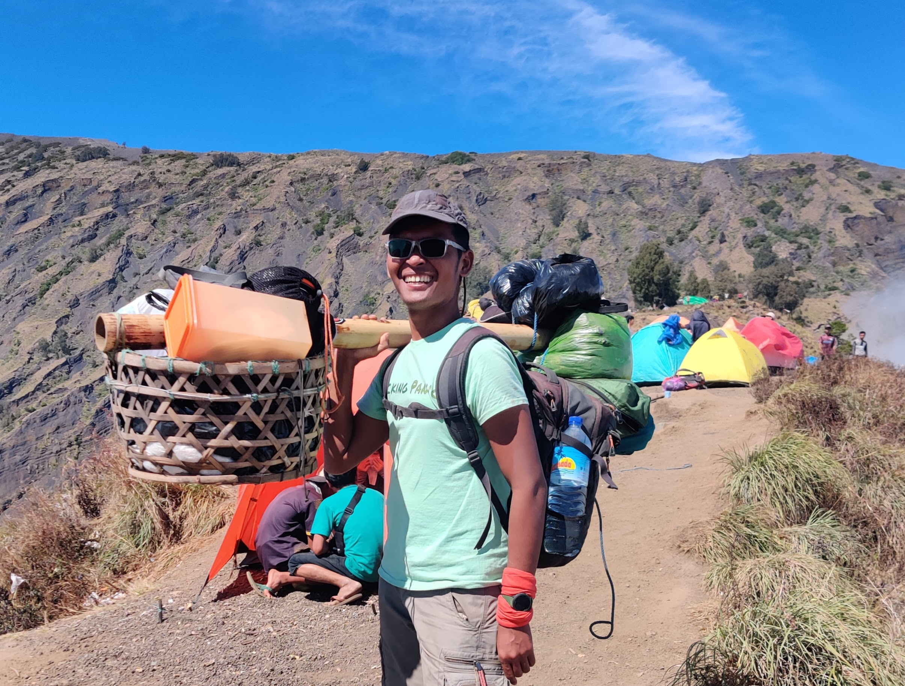
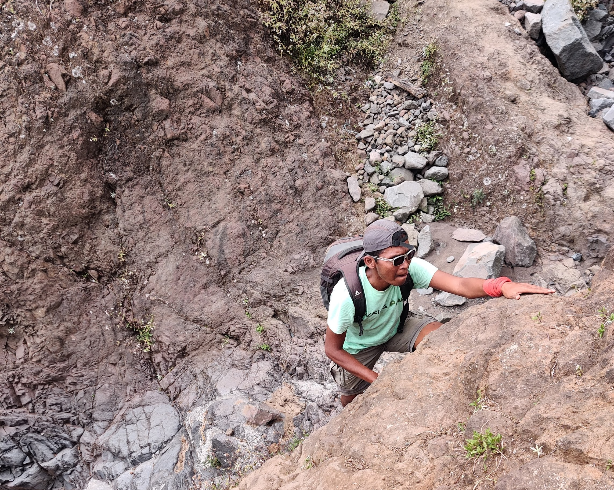

After completing an epic trek on Mount Rinjani, I returned with a sense of happiness and unforgettable memories. The magnificent scenery, lush nature, and the thrill of reaching the summit all became part of my challenging and wondrous journey.

Careful planning was key to ensuring the smooth and joyful progress of my expedition. The packing list played a vital role in my adventure, and I made sure to bring all the necessary equipment to ensure a safe and enjoyable journey.

## Overview

- [Shared Equipment (Available for Rent from Local Porters and Guides)](#shared-equipment-available-for-rent-from-local-porters-and-guides)
- [Personal Gear](#personal-gear)
- [Water Management Strategy](#water-management-strategy)
- [Making the Most of My Existing Backpack](#making-the-most-of-my-existing-backpack)
- [Staying Organized](#staying-organized)
- [Additional Notes That Might Be Useful](#additional-notes-that-might-be-useful)

## Shared Equipment (Available for Rent from Local Porters and Guides)

1. **Tents:** I spent my nights in spacious and sturdy tents, rented to ensure a comfortable and weather-protected sleep amidst the unpredictable mountain climate.

2. **Cooking Gear:** The local guides and porters had arranged a complete set of cooking equipment, including stoves and other tools. With this convenience, I could focus on enjoying delicious meals on the mountain without the hassle of carrying my own cooking gear.

3. **Food Supplies:** Essential food provisions were carried by dedicated local porters. They made sure I had nutritious meals to keep me energized throughout the challenging journey. Supporting the local community while lightening my load—what a win-win!

4. **Camping Gear:** The porters also provided comfort items such as chairs and tables, enhancing my camping experience. Gathered around the campsite, I shared stories, felt connected to nature, and formed stronger bonds with fellow trekkers.

5. **Trash Bag:** As a responsible hiker, I brought my own trash bags to collect and carry back any litter I encountered along the way. It's a small step, but crucial in preserving the cleanliness and beauty of beloved Mount Rinjani.

## Personal Gear

Let's start with clothing. For higher altitudes, it's crucial to stress the inclusion of long-sleeve options to combat the increasing cold. This becomes particularly significant when preparing for a 3-day, 2-night Rinjani hike, where clothing choices are pivotal.

Altitude variations introduce noticeable temperature shifts. As you ascend, it gets colder—especially during early morning summit attempts, when temperatures drop unexpectedly. To counter this, packing proper clothing layers is key. While t-shirts suffice initially, transitioning to long-sleeve becomes essential for higher altitudes. These aren't a luxury; they're a vital shield against the biting mountain air.

Speaking from experience, cold weather is intense. Freezing temperatures, especially early in the day, are common. This is where thoughtful clothing layers shine. Incorporating warm outerwear like fleece jackets or thermal tops, along with insulated jackets, significantly boosts comfort and motivation. Accessories like gloves play a crucial role in protecting against the cold.

This approach turns your attire into a shield, ensuring warmth, comfort, and determination remain steady on your journey.

To provide you with a detailed breakdown of my clothing choices, here's my list:

- 3 t-shirts
- 2 pants
- Base Layer Pants
- Long-sleeve jumper
- Lightweight jacket for warmth
- Gloves
- 3 pairs of hiking socks (2 for hiking, 1 for sleeping)

And here are the other personal items I brought along:

1. Backpack: My faithful companion since 2017, the Eiger Digi Vault 2.0 28L, played a central role in my packing list. This loyal backpack has accompanied me on numerous backpacking journeys, proving its durability and perfectly fitting size.

2. Trekking Shoes: The challenging terrain demanded sturdy and comfortable trekking shoes with excellent grip. My reliable pair provided the stability needed to conquer the demanding trails.

3. Sleeping Bag (Available for Rent): To ensure a restful sleep amidst the mountains, I chose to rent a comfortable sleeping bag, aligning with the principles of responsible travel.

4. Sleeping Mat (Available for Rent): Together with the sleeping bag, I also rented a cozy sleeping mat, adding a touch of luxury to my slumber under the stars.

5. Headlamp: The hands-free headlamp served as my guiding light during early morning starts or night hikes. Its reliable beam led me through darkness, embracing the mysteries of the night.

6. Personal Hygiene Kit: Staying fresh was crucial, so I packed necessary items in my backpack, including a microfiber towel. Compact and lightweight, it absorbed moisture effectively and dried swiftly, making it handy for wiping off sweat or after a quick cleanup. Its space-saving design was a bonus during trekking, and it proved practical for various situations, from staying cool to dealing with sudden weather changes.

7. Sun Protection: With sunscreen, sunglasses, and a wide-brimmed hat, I shielded myself from the scorching sun at high altitudes. These little things made a big difference in my comfort during the trip.

8. Rain Gear: Unpredictable mountain weather called for a lightweight rain jacket and poncho. Having these items ensured I stayed dry and spirited, even if the heavens suddenly opened up.

9. First Aid Kit: Safety comes first! My simple first aid kit included essentials like band-aids, antiseptic wipes, and pain relievers, providing reassurance during my outdoor adventure.

## Water Management Strategy

Water management is a crucial aspect of any mountain trek. During the hike, I always carried two 1500 ml bottles to ensure proper hydration. If I needed more, I could refill and ask the porter, who also carried additional water supplies. These additional sources, such as Danau Segara Lake, were invaluable for maintaining hydration levels.

It's essential to emphasise the importance of staying hydrated, particularly at higher altitudes. The mountain environment can be demanding, and maintaining your hydration can significantly impact your overall well-being and the success of your trek. Along the trail, various water sources present themselves as lifelines, and proper purification methods ensure that the water you consume is safe.

One notable strategy I employed was to place a spare water bottle at my tent during the summit hike from Pelawangan. This tactical decision allowed me to navigate the challenging elevation gain to the peak without unnecessary weight. As the ascent became steeper and more demanding, having a strategically placed water bottle at the tent meant I could access hydration as needed during rest breaks. This approach highlights the importance of planning and considering the unique challenges of the trail.

## Making the Most of My Existing Backpack

Among Mount Rinjani's stunning vistas and challenging terrain, it was clear that this expedition required more than physical strength. The rugged landscapes, steep inclines, and unpredictable weather emphasized the need for thorough preparation. As I navigated through this captivating yet demanding environment, my backpack, the Eiger Digi Vault 2.0 28L, emerged as a symbol of support—a protective haven for my belongings and a wellspring of solace during trying moments.

Having accompanied me on various backpacking ventures since 2017, this reliable companion demonstrated its importance. Its impeccable fit and cushioned straps embraced me securely, reducing discomfort and preventing shifting while navigating rocky paths and unpredictable elements. However, it's important to recognize its inherent limitations. Unlike specialized hiking backpacks, mine lacked features like a hip strap for ideal weight distribution. This omission led to compromises and suboptimal weight distribution. Furthermore, the backpack's ventilation system fell short of perfection, eventually causing discomfort during the hike. Worth mentioning is the fact that my backpack does have a slot for attaching a portable hip strap, highlighting its adaptability.

For the best hiking experience, consider a backpack with cushioned hip straps and good back ventilation. These attributes significantly amplify comfort during demanding treks, as proper ventilation prevents excessive perspiration and discomfort stemming from trapped heat against the back.

So, while my backpack served its purpose, its general design wasn't tailored for hiking, requiring adaptation and flexibility to suit this particular expedition. Carrying my belongings, initially manageable, grew harder as the hike advanced, particularly with the added necessity of carrying three liters of water. This additional weight, combined with my backpack's design that relied solely on my shoulders for support, underscored the importance of a balanced weight distribution system. Shoulder strain became more pronounced, highlighting the importance of a backpack designed for even weight distribution and reduced stress on specific body areas.

Temprary storing non-essential items and carefully selecting the needed gear before the hike proved beneficial.

## Staying Organized

I didn't forget to include a packing cube in my preparations, a go-to tool for keeping my belongings organized and tidy. With the packing cube, I easily separated my clothes, toiletries, and other items, ensuring everything stayed neat and easily accessible when needed.

Additionally, I brought a dry bag, a powerful storage solution for dirty clothes. During my adventure, unpredictable weather or strenuous activities sometimes left clothes damp and dirty. The dry bag became a savior for used clothes, preventing them from soiling other items inside the backpack.

With the packing cube and dry bag, my backpack became even more organized and free from clutter. I could explore nature with a clear focus on the surrounding beauty, without worrying about rummaging through my backpack to find specific items.

## Additional Notes That Might Be Useful

While I was content with my packing choices for my Mount Rinjani adventure, there were a couple of aspects I considered that might be helpful for future trekkers:

- Snug Bunny for Warmth: Looking back, I couldn't help but think about the warmth and comfort a snug bunny could provide during the cold nights on the mountain. It's remarkable how certain items can become incredibly valuable in different circumstances.

- Trekking Pole Consideration: Although I confidently relied on my own feet, I realized that trekking poles could be beneficial, especially on challenging terrain. Renting trekking poles is an option worth exploring for those who feel they might enhance their trekking experience.

- Managing Rented Gear: While renting gear offers convenience, it's important to be mindful of the space it occupies. The rented sleeping bag, for instance, occupied a significant portion of my backpack. Being aware of the potential spatial impact of rented equipment can help maintain a well-balanced pack.

- Optimizing Backpack Selection and Utilizing Features for Enhanced Comfort: I find myself wishing that I had taken the opportunity to attach a portable hip strap to my backpack. The potential for better weight distribution and enhanced comfort during my journeys is something I now recognize and would have greatly appreciated.

Moreover, for hikers camping at the Danau Segara site, an added convenience awaits. There's a possibility to do quick laundry at the camping ground, allowing you to freshen up your clothes and have them dry before embarking on the next leg of your journey the following day. This practical amenity can significantly contribute to your overall comfort and cleanliness during the trek, making your Mount Rinjani experience even more enjoyable.

In retrospect, my Mount Rinjani hike was a blend of careful preparation, valuable lessons learned, and unexpected conveniences. Each aspect of my packing contributed to an unforgettable adventure that not only tested my physical limits but also allowed me to appreciate the beauty and challenges of the great outdoors.

As you prepare for your next adventure, remember to consider all aspects of your equipment and planning. Collaborate with noted references if provided by your sources to enhance the credibility of your information. Water management, clothing considerations, and gear checklists are all crucial factors for a successful trek. By staying organised, making use of existing gear, and employing effective strategies, you can embrace the great outdoors with enthusiasm and dependable gear by your side at every turn. Enjoy the unforgettable moments, savor the beauty of nature, and embark on your expedition with confidence! Additionally, for more lightweight travel equipment and a wide range of other travel essentials, be sure to check out [Packing Panic's shop](www.packingpanic.de).
