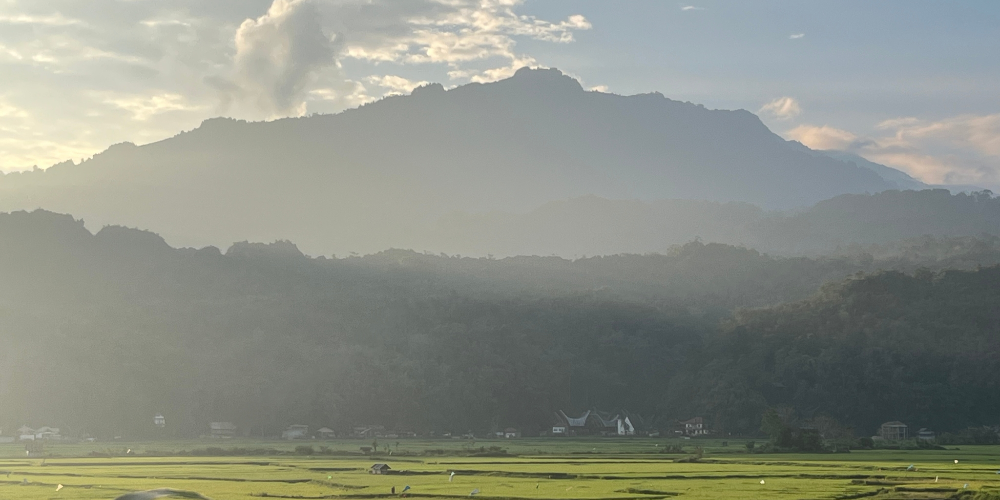
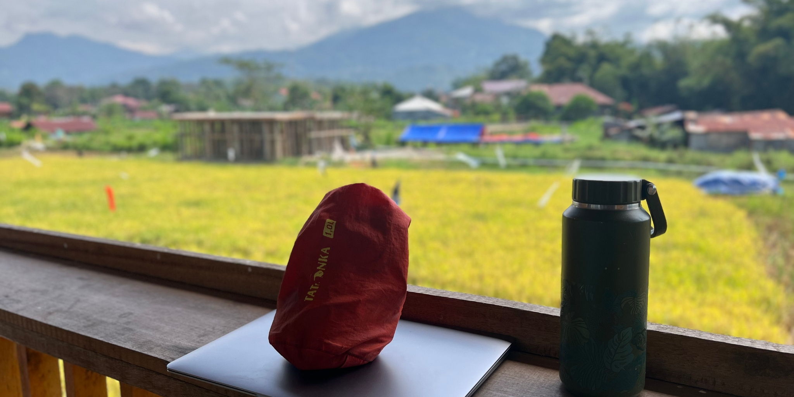
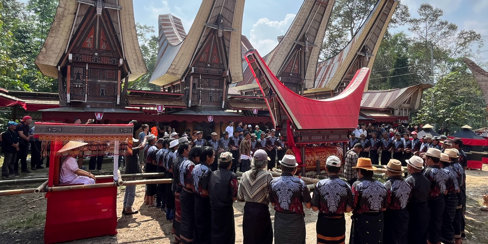
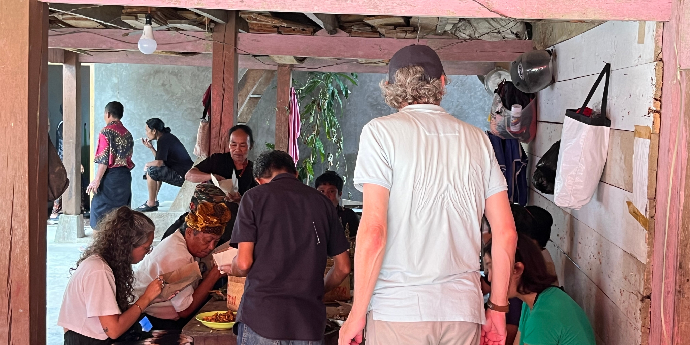
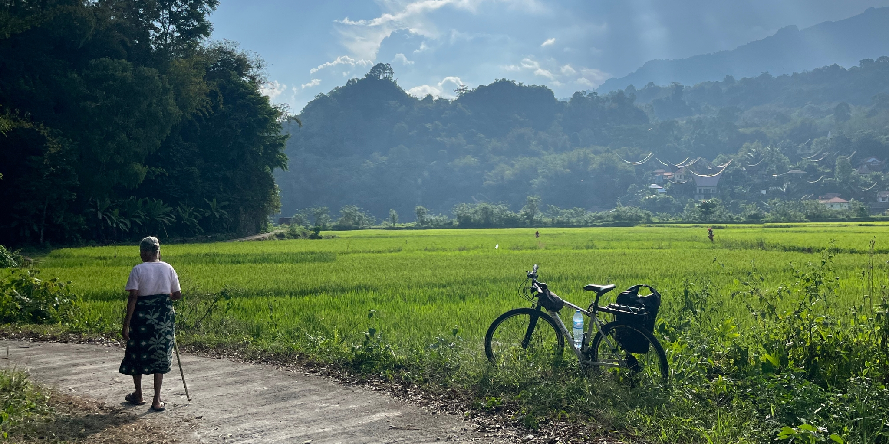
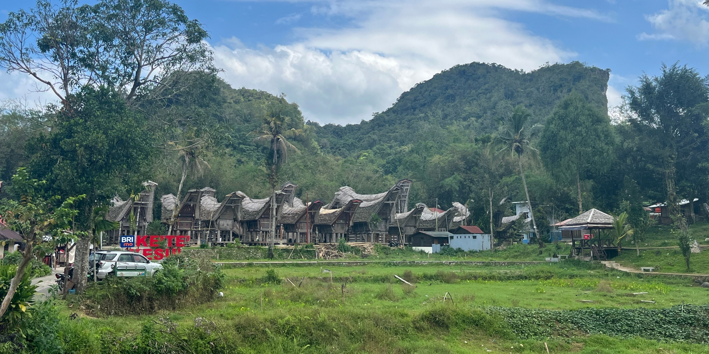
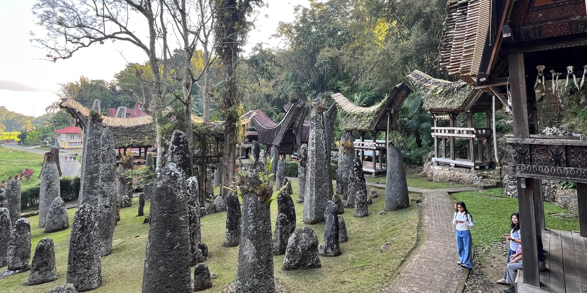
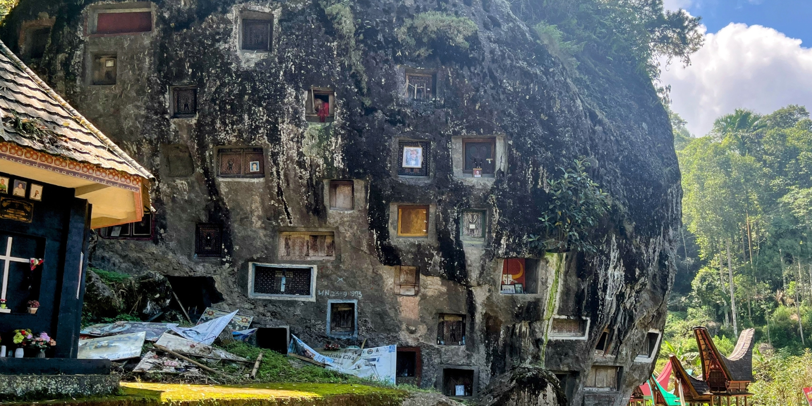
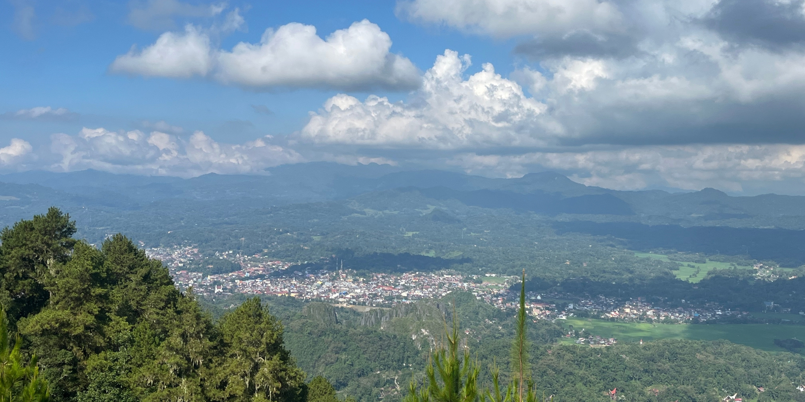

Toraja, nestled in the misty highlands of South Celebes, Indonesia, is one of the most culturally compelling and spiritually rich destinations I’ve had the privilege to explore. Renowned for its unique animist beliefs, awe-inspiring mountain scenery, and world-famous funeral rites, it’s a place where life and death share the same sacred space.

“Celebes" is the former English name for the Indonesian island now known as Sulawesi. The name "Celebes" was given to the island by Portuguese explorers, and it became the common English name following Indonesian independence.

I originally planned to spend just a couple of nights in Rantepao, the gateway to North Toraja. But like many travellers before me, I was captivated — and ended up staying an entire week. What follows is a personal account of my journey through this remarkable region and why it left such a lasting impression on me.

## Overview
- [Getting to North Toraja Independently](#getting-to-north-toraja-independently)
- [Rantepao — Cultural Heart of the Highlands](#rantepao--cultural-heart-of-the-highlands)
- [Rambu Solo: A Celebration of Life Beyond Death](#rambu-solo-a-celebration-of-life-beyond-death)
- [Places Not to Miss in North Toraja](#places-not-to-miss-in-north-toraja)
- [The Kindest People in Indonesia?](#the-kindest-people-in-indonesia)
- [Practical Advice](#practical-advice)
- [Final Reflections](#final-reflections)

### Getting to North Toraja Independently

Travelling independently to North Toraja is quite straightforward, even if you’re going it alone. From the city of Makassar, I took an overnight coach with **Borlindo** — [you can check their schedules here](https://borlindo.com/home/) — which whisked me through lush landscapes and into the heart of the highlands in around eight hours. 

The buses are surprisingly comfortable, complete with reclining seats and air conditioning, making it easy to sleep through the journey. Several other companies operate similar services, and if you arrive via Makassar airport, some local guides in Rantepao can also help arrange direct transport, making the trip even more seamless.

The Excecutive ticket cost me IDR 200,000 with additional IDR 100,000 since I carried my bicycle with me. 

### Rantepao — Cultural Heart of the Highlands

Administratively, the Toraja region is divided into two main areas: Tana Toraja and Toraja Utara, which means North Toraja. Both are located in the highlands of South Sulawesi Province, forming part of a wider region that people often refer to simply as Toraja. Tana Toraja is the older of the two, historically and culturally important, while North Toraja has become the main base for travellers. Most tourism infrastructure, including guesthouses, cafés, and access to ceremonies, is centred around Rantepao, the largest town in North Toraja.

The people who live here are known as Torajans, an ethnic group with their own traditions, language, and belief systems. They speak Sa’dan Toraja, a regional Austronesian language, though Indonesian is widely understood. Many Torajans today identify as Christian, particularly Protestant, due to missionary efforts in the early twentieth century. However, traditional beliefs are still deeply respected and observed. These beliefs are collectively referred to as Aluk To Dolo, meaning "The Way of the Ancestors". They govern rituals related to life, death, agriculture, and social structure.

Staying in Rantepao offers more than just a convenient base. It places you at the heart of a living culture. You will see traditional Tongkonan houses standing proudly among rice fields, water buffaloes being led through narrow roads, and local markets alive with activity. I stayed at a guesthouse run by **Paulus**, a warm and welcoming host with years of guiding experience. He is also the author of *[This is Toraja](https://isleden.gf/1104383-this-is-toraja.html)*, a brilliant book that offers cultural insight and travel wisdom. His homestay, [Purabarang](https://maps.app.goo.gl/LkzkCXazXM9QpszU7) is quiet, surrounded by rice fields, and just a short walk from town. You can contact him at +62 85398768345.

I planned to stay two nights at Paulus’s place but ended up staying a full week. It is located about two kilometres from the centre of Rantepao, peaceful and quiet, yet still accessible. Since I was also working remotely, the setting was ideal. Having a view of Mount Sesean while working made the experience even more enjoyable.

As always, I had my trusted [1L Packsack](https://www.packingpanic.de/dp/11-4/packsack-1l/#/4-farbe-rotorange_red_orange) with me — the perfect size for keeping all my electronic essentials organised and dry. If you are looking for practical and reliable gear for your own travels, check out [full electronics collection here](https://www.packingpanic.de/shop/14/elektronik/).

The town becomes lively in the early mornings, especially around **Pasar Bolu**, the traditional market and one of the most vibrant places in Rantepao. It is a colourful and lively mix of people, smells, and movement. You will find everything from fresh produce and local spices to handmade textiles, betel nuts, and woven baskets. On certain days, the market also hosts a buffalo trading section, where large animals are displayed and sold, many destined for future Rambu Solo ceremonies.

When I needed a quiet moment, I spent time at **Kaana Toraja Coffee** [location here](https://maps.app.goo.gl/CdKH8fkytqkQ9XYy8). Tucked away from the road, it serves some of the region's best locally grown beans. The coffee is smooth and bold, the space welcoming with bamboo walls and hand written menus. It is the perfect place to unwind, reflect, or watch the clouds roll past the hills.

### Rambu Solo: A Celebration of Life Beyond Death

The pinnacle memory for travellers visiting Toraja would be witnessing **Rambu Solo**, the traditional funeral ceremony that honours a person’s passage from this world to the next. This is not a quiet event hidden from the community. It is a large public gathering filled with deep meaning and a remarkable sense of unity.

Rambu Solo is not a time for silence or sorrow in the way many of us may expect. It is a celebration of life. It is a final act of love and respect, offered by the living to help the soul of the deceased reach **Puya**, the land of the ancestors. These ceremonies can last for several days and include traditional music, ritual performances, storytelling, communal meals, and the symbolic sacrifice of buffalo and pigs. These animals are believed to help carry the soul toward the afterlife, especially the buffalo, which holds deep spiritual and social value.

I found several ceremonies happening during my visit, thanks to updates from the local tourism office shared on Instagram [@visittorajautara](https://www.instagram.com/visittorajautara). They post schedules and locations, which makes it easy for travellers to join in respectfully. I decided to attend one of them on my own. I was not sure how it would feel to be present at such a sacred moment as an outsider.

But what happened was far from distant or formal. I was greeted warmly. Families welcomed me in, offered food, and shared the meaning behind each part of the ritual. I did not go with a guide, but I never felt unsure or out of place. It was clear that the people of Toraja are proud of their traditions and happy to share them with those who come in a spirit of respect and interest.

As an Indonesian, I could communicate easily with the locals, which made the experience even more enriching. That said, hiring a guide would still be very beneficial as they can offer deeper insights, help navigate ceremony etiquette, and unlock stories you might otherwise miss.

One moment that truly stayed with me was the **Ma Palao** ceremony. This is the part where the deceased is carried through the village in a beautifully carved wooden coffin. Dozens of people gather to lift and escort it, moving in time with the beat of gongs and drums. The music is intense, the atmosphere filled with movement and feeling. People chant, dance, and celebrate as the procession winds its way forward. It is emotional, spiritual, and full of life.

Everyone takes part, from elders to children. I saw people preparing food, organising offerings, and dancing side by side. It is not just a family event, it is a village effort. I felt surrounded by something very real, something shared by everyone present.

The sacrifice of buffalo might be difficult to witness at first, but it carries deep meaning. These animals are not seen as ordinary livestock. They are companions for the soul, helping it cross over to the world beyond. The more buffalo offered, the greater the honour for the departed. It is a final gift, and it is given with love and belief.

During one full ceremony cycle I followed, each day had its own part to play. There was the preparation of the coffin, the gathering of family, the placing of stones, the sacrificial offering of buffalo, the lifting of the body, and the final burial. Other rituals involved music, visiting the ancestral house, dancing, and community meals. Everything felt connected and full of purpose.

Back home, death is often something we hide from or avoid speaking about. In Toraja, it is embraced. It is not feared, but met together with ritual and strength. It is a part of life, just as important as birth or marriage. And it brings people together in a way I rarely see anywhere else.

Before I arrived, I had only heard stories. But after attending Rambu Solo in person, I understood why it is often described as one of the most moving cultural experiences in the world. You do not simply observe it. You feel it. You are changed by it.

Toraja gave me a new way to think about death. Not as an ending, but as a powerful transition — one marked with music, prayer, shared meals, and the warmth of community. It is a place where memory is kept alive through tradition, and where love continues long after a person has passed on.

### Places Not to Miss in North Toraja

North Toraja is filled with cultural gems, sacred spaces, and natural wonders that deserve to be experienced slowly and with curiosity. While ceremonies like Rambu Solo offer insight into the spiritual life of the Torajan people, the land itself holds stories carved in wood, stone, and mountain air. Here are some of the most memorable places I visited — each one adding its own voice to the Toraja story.

#### Kete Kesu

Just a short scooter ride from Rantepao is **Kete Kesu**, one of the most well preserved traditional villages in the region. The layout is simple but powerful. Tongkonan houses stand proudly in a row, with their curved roofs reaching skyward, each one decorated with carvings and buffalo horns that reflect the family’s heritage. Beside them are the rice barns, built with the same care and detail. Behind the village, cliffs hide ancient graves, and if you look closely, you will see wooden figures known as **Tau Tau**. These effigies are made in the likeness of the deceased, and they stand watch over the valley in silent remembrance. Being there feels like walking inside a story that is still being told.

#### Kalimbuang Bori

Another spot that left a deep impression on me was **Kalimbuang Bori**, sometimes referred to as the Torajan Stonehenge. This ceremonial field is filled with towering stone monoliths, each one erected in honour of a respected individual. Some stones are narrow and tall, others more squat and weathered, but together they create a kind of spiritual field that seems to hum with the energy of the past. I arrived early in the morning, just as mist was rising from the grass, and the silence was almost overwhelming. As I wandered through the stones, I felt a quiet sense of respect, like I was walking through a place that remembers.

#### Lo ko Mata

Further into the hills is **Lo ko Mata**, a burial site unlike any I had ever seen. Here, tombs are carved directly into massive boulders that sit among terraced rice fields and forested hillsides. It is peaceful and striking, a place where nature and memory sit side by side. I chose to cycle there, which was quite the challenge. The route involved more than one thousand metres of elevation gain, and the roads were steep in parts. But every bit of the climb was worth it. I passed waterfalls, waved to children in remote villages, and caught glimpses of mountain peaks through the trees. By the time I reached Lo ko Mata, I was exhausted but deeply content. It is the kind of place that rewards effort not just with views, but with a feeling of having arrived somewhere meaningful.

#### Lolai

And then there is **Lolai**, often called the **Land Above the Clouds**. This ridge top village offers one of the most spectacular sunrise views in all of Sulawesi. In the early hours, clouds settle below the ridge like a sea of cotton, and as the sun rises, the golden light begins to spill across the peaks and valleys. It is a moment of stillness and awe. Getting there is not difficult, but the road is steep and winding. I would recommend renting a scooter or arranging a driver, especially if you are not used to mountain roads. But once you are there, sitting with a cup of coffee and watching the clouds float beneath you, the journey feels small compared to the beauty in front of you.

Each of these places offered me something different — a glimpse of Torajan history, a moment of reflection, a connection to the landscape. Together, they shaped my understanding of this remarkable region. If you are heading to North Toraja, do not miss them. They are more than just places on a map. They are living parts of a culture that continues to honour its past while moving quietly forward.

### The Kindest People in Indonesia?

I’ve journeyed across many parts of Indonesia — from the beaches of Lombok to the jungles of Sumatra — and I have to say, the **Torajan people are some of the friendliest I’ve ever met**. There’s an openness and generosity here that goes beyond hospitality. Locals didn’t just smile; they invited, explained, shared, and celebrated with me.

Even without hiring a guide, I always felt welcomed and looked after. Whether at ceremonies, on the road, or in cafés, people were genuinely curious and happy to help.

### Practical Advice

If you have more time, consider visiting Makale, a nearby town that is home to the second tallest statue of Jesus Christ in the world. It is a popular photo stop and a natural extension of a Toraja trip.

Usually, travellers will continue their journey back to Makassar, the fourth largest city in Indonesia. As a major transport hub, Makassar is well connected to destinations across the country, making it an ideal place to catch flights or buses heading west toward Java and Sumatra, or east toward the Maluku Islands and Papua. Some adventurous travellers choose to continue their journey across Sulawesi itself, heading north through the central highlands and on to Manado in the far north.

If you need help organising any of these routes, contact **Paulus**. He often assists travellers with arranging buses, private transport, and onward travel across Sulawesi. A true gem of a host.

### Final Reflections

Toraja is not just a place you visit — it is a place that stays with you. The connection between people, land and tradition is so tangible here that it is almost impossible not to be moved by it.

From sacred funeral ceremonies to cloud kissed mountain peaks, from ancient graves to endless kindness, the highlands of North Toraja offer something deeply human. If you are seeking something more meaningful than the typical tourist trail, this is where you will find it.

I arrived a curious traveller and left with a heart full of stories, gratitude, and a longing to return.

If you are preparing for your own journey — especially one where packing smart matters — explore Packing Panic's [lightweight travel gear collection](https://www.packingpanic.de/shop/2/startseite/) designed for minimalist, meaningful adventures.